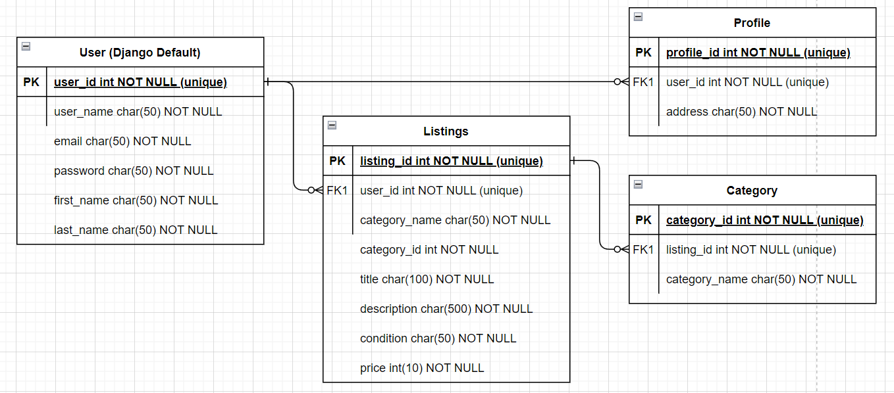
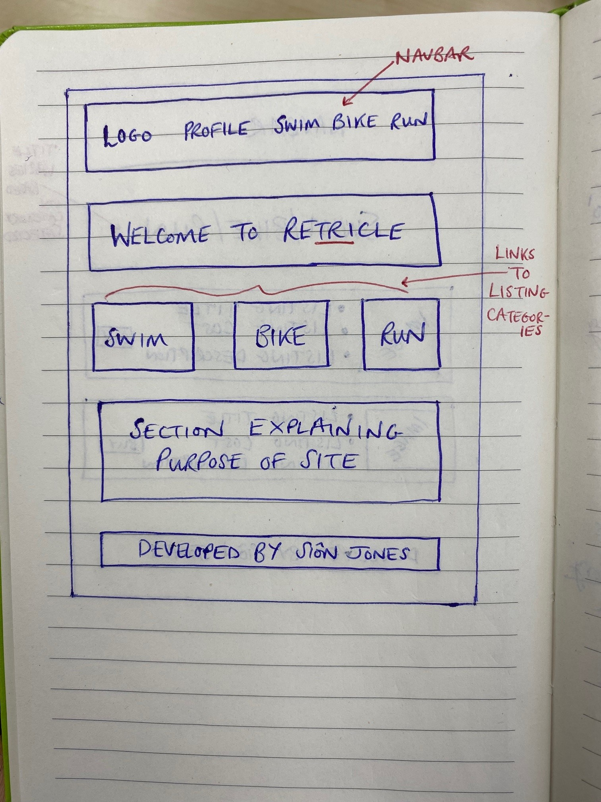
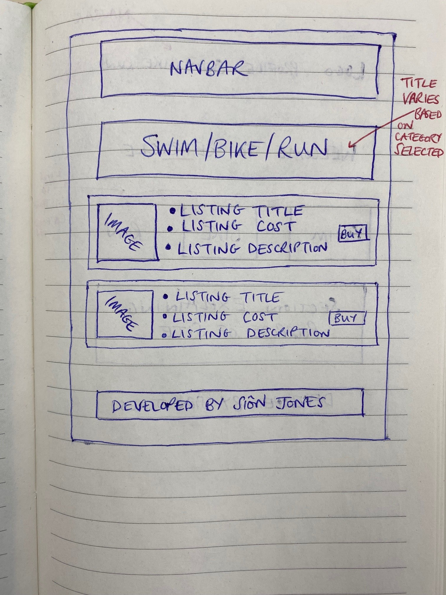
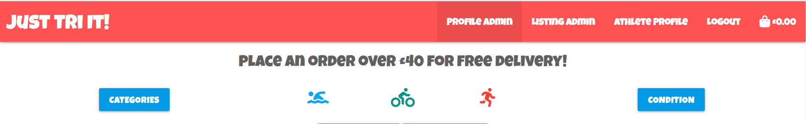
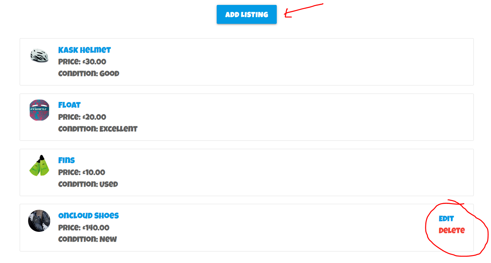
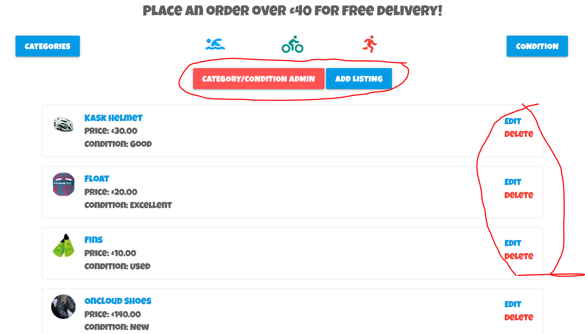
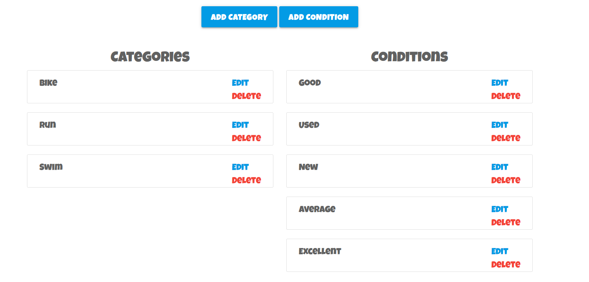
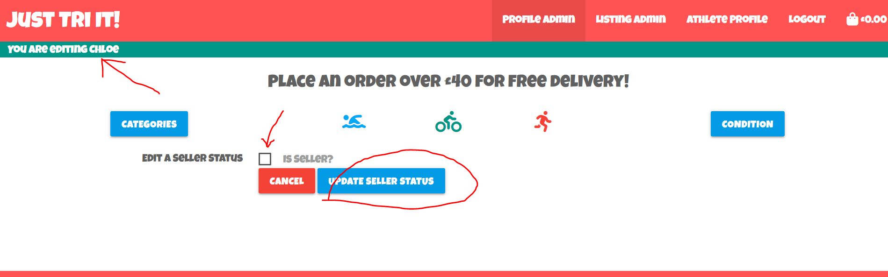

# Read Me

# Just Tri It

# User Stories

There are three types of user on the site: 
A user who would register to view and purchase listings only.
A user with seller status who can do the above as well as add their own listings for others to purchase as well as edit and delete their own listings.
Finally, a superuser who can update a user’s seller status, add listings and edit or delete any listing listed on the site.

- As a user, I want to be able to add various listings to my basket before completing a purchase via a check out.
- As a user, I want to be able to filter listings by the three main triathlon disciplines of Swim, Bike and Run.
- As a user, I want to be able to filter listings by their condition such as New, Excellent, Good or Used.
- As a user, I want to be able to see an overall summary of all listings available to purchase.
- As a user, I want to be able to click on an individual listing to see more information regarding the listing.
- As a user, I want to be able to vary the quantity of a listing I can input into the basket when viewing the listing.
- As a user, I want to be able to update the quantity and/or remove a listing from my basket.
- As a user, I want to be able to create an account/profile.
- As a user, I want to be able to save default information in my account profile.
- As a user, I want to be able to view my previous order history.
- As a user with seller status, in addition to the above, I want to be able to add, edit and delete any listings I have uploaded.
- As a super user, in addition to the above, I want to be able to edit and delete any listing on the site.
- As a super user, in addition to the above, I want to be able to update a registered profile’s seller status.
- As a super user, in addition to the above, I want to be able to add, edit and delete categories and conditions.

# UX

The aim of the site is to be as minimal as possible so that attention is focused on the database content.

The website utilises Materialize CSS to responsively react to different screen sizes so that the user can view content on multiple devices.

## Colour Scheme

The colour scheme below was generated by [coolors](https://coolors.co/).

I selected the colour scheme by selecting a different colour to represent each of the three sports that make up the triathlon discipline on a white background with granite text.


# Initial Visual ERD



This is an initial mock-up of the data structure completed at the start of the project. The models evolved as the project progressed however this Initial Visual ERD is a fairly accurate representation of how the data is structured in the project.

# Wireframes

## Initial Wireframes





Note: The wireframe images contain the old name for the site _Retricle_.

# Features

## Existing Features

### Navbar

The responsive navbar features the site logo on the left-hand whilst the options available on the right-hand side vary depending on user authentication status. The logo is a hyperlink to the site’s home page.
If a visitor to the site is not registered/logged in, the options displayed will be Register, Log In and the shopping basket.
If a user is logged in, does not have seller status and is not a super user, the options displayed will be Athlete Profile, Log Out and the shopping basket.
If a user is logged in, has seller status and is not a super user, the options displayed will be Athlete Profile, Listing Admin, Log Out and the shopping basket.
Finally, if the user is logged in and is a super user, the options displayed will be Profile Admin, Listing Admin, Athlete Profile, Log Out and the shopping basket.
The content of the navbar collapses into a side-nav on medium screen sizes and below where all the above still applies. When the menu collapses to become a side-nav, the logo shifts to the middle of the navbar.

### Promo Banner

The site displays a banner for promotional messages on all pages immediately below the navbar on all screen sizes.

### Filter Buttons Category and Condition

These buttons allow the listings to be filtered by category or by their condition.



### Add, Edit, Delete Listing Buttons (Own Listings if Seller, All Listings if SuperUser)

If a user has seller status, they are able to add a listing as well as edit/delete any listing they have uploaded.



If a user is a superuser, they are able to add a listing as well as edit/delete any listing uploaded by any user.



### Add, Edit, Delete Category/Condition (If SuperUser)

If a user is a superuser, they can also add/edit/delete categories and conditions.



### Apply/Remove 'Seller Status' (If SuperUser)

If a user is a superuser, they can amend another user's seller status.



### Footer

The footer displays on all pages across all screen sizes and is always fixed to the bottom of the page. It contains the store name, a copyright logo and information on the site’s developer.

### Favicon


## Features Left to Implement

- I would like to develop the store into an eBay style store with ratings for Buyers/Sellers etc.
- Customised Error Handling page.
- Apply my own formatting to the allauth pages.
- Sending real emails.
- Conduct unit testing.

# Technologies Used

- [Git](https://www.atlassian.com/git) - used for version control.
- [GitHub](https://github.com/) - used to secure my code online.
- [GitHub Projects](https://github.com/sniclasj?tab=projects) - used to log any issues and mark as closed once resolved.
- [Gitpod](https://www.gitpod.io/) - used as the cloud-based IDE.
- [Django](https://www.djangoproject.com/) - used to create the Python web application.
- [dbSQLite3](https://www.sqlite.org/index.html) - used the development side database.
- [Heroku](https://id.heroku.com/login) - used to deploy the site.
- [Amazon AWS](https://aws.amazon.com/?nc2=h_lg) – used to store static files used by the site.
- [Materialize CSS](https://materializecss.com/) - used to create the layout and structure of the website.
- [HTML](https://en.wikipedia.org/wiki/HTML) - used to write the code for the website.
- [Python](https://en.wikipedia.org/wiki/Python_(programming_language)) - used to write the code for the website.
- [JavaScript](https://en.wikipedia.org/wiki/JavaScript) - used to initialise website events.
- [JQuery](https://en.wikipedia.org/wiki/JQuery) - used to initialise website events.
- [CSS](https://en.wikipedia.org/wiki/CSS) - used to style the website.
- [Stripe](https://stripe.com/gb) - used to simulate taking payments on the site.
- [PostgresQL](https://www.postgresql.org/) - used as database on live site.

# Testing

To view all testing documentation, please refer to [TESTING.md](TESTING.md).

# Django Set Up

To install django, follow these steps:

- In your IDE type `pip3 install django`.
- To name your project type `django-admin startproject *Insert Project Name*`.
- Create a gitignore file via `touch .gitignore`.
- Add any files that should not be commited to version history to gitignore.
- Run `python3 manage.py runserver` in the terminal. This should expose port 8000 and if the steps have been followed correctly, Django's success page will display.
- Perform the initial migrations by running `python3 manage.py makemigrations --dry-run` followed by `python3 manage.py makemigrations` then `python3 manage.py migrate --plan` and finally `python3 manage.py migrate`.
- Create a superuser to gain access to the admin panel via `python3 manage.py createsuperuser`.
- Create a username and password along with an option of including an email address.
- Make the initial commit to github.

## All Auth

All Auth is Django's package for managing sign up, log in, log out etc. The steps to install can be found [here](https://django-allauth.readthedocs.io/en/latest/installation.html).

# Heroku Deployment

This project uses [Heroku](https://www.heroku.com), a platform as a service (PaaS) that enables developers to build, run, and operate applications entirely in the cloud.

Deployment steps are as follows, after account setup:

- Select *New* in the top-right corner of your Heroku Dashboard, and select *Create new app* from the dropdown menu.
- Your app name must be unique, and then choose a region closest to you (EU or USA), and finally, select *Create App*.

- From the new app *Settings*, click *Reveal Config Vars*, and set the following key/value pairs:
  - `DATABASE_URL` (this comes from the _Resources_ tab, you can get your own Postgres Database using the Free Hobby Tier)
    - Click on the _Resources_ tab.
    - Search for Postgres in the 'Add-ons' search bar.
  - `SECRET_KEY` (this can be any random secret key)
- Further key/value pairs will follow on this project and these will be detailed in the coming sections. These will eventually be:
  - `AWS_ACCESS_KEY_ID`
  - `AWS_SECRET_ACCESS_KEY`
  - `STRIPE_PUBLIC_KEY`
  - `STRIPE_SECRET_KEY`
  - `STRIPE_WH_SECRET`
  - `USE_AWS`

Heroku needs two additional files in order to deploy properly.
- requirements.txt
- Procfile

You can install this project's requirements (where applicable) using: `pip3 install -r requirements.txt`. If you have your own packages that have been installed, then the requirements file needs updated using: `pip3 freeze --local > requirements.txt`

The Procfile can be created with the following command: `echo web: python app.py > Procfile`

For Heroku deployment, follow these steps to connect your GitHub repository to the newly created app:

Either:
- Connect Heroku and GitHub via the Deploy tab.
- Then select "Automatic Deployment" from the Heroku app.
- Click the _Deploy Branch_ button.

Or:
- In the Terminal/CLI, connect to Heroku using this command: `heroku login -i`
- Set the remote for Heroku: `heroku git:remote -a <app_name>` (replace app_name with your app, without the angle-brackets)
- After performing the standard Git `add`, `commit`, and `push` to GitHub, you can now type: `git push heroku main`

The frontend terminal should now be connected and deployed to Heroku.

## Heroku and Django

This section covers the interaction between HEroku and Django in more detail than the Heroku section above.

- Type `pip3 install dj_database_url` into the terminal followed by `pip3 install psycopg2-binary`.
- Ensure to freeze requirements by typing `pip3 freeze > requirements.txt`.
- In settings.py within add the following line to the top of the file:  
    ```
    import dj_database_url
    ```
- Further down the file at the database settings, comment out the default configuration and insert the following code beneath the commented out default:  
    ```
    DATABASES = {
        'default': dj_database_url.parse(*ENTER DATABASE URL HERE*)
    }
    ```
- Note: The database URL will be located in the Heroku config vars.
- Migrations will need to be run again as you are now connected to a new database. This is done by running `python3 manage.py makemigrations --dry-run` followed by `python3 manage.py makemigrations` then `python3 manage.py migrate --plan` and finally `python3 manage.py migrate`.
- Create a new SuperUser for the new database via `python3 manage.py createsuperuser`.
- Before commiting, ensure that the Postgres Database is moved to env.py to prevent it being exposed in version control.
- Add an if statement in settings.py to run the postgres database when using the app on Heroku or sqlite if not as shown below:
    ```
    if 'DATABASE_URL' in os.environ:
        DATABASES = {
            'default': dj_database_url.parse(os.environ.get('DATABASE_URL'))
        }
    else:
        DATABASES = {
            'default': {
                'ENGINE': 'django.db.backends.sqlite3',
                'NAME': BASE_DIR / 'db.sqlite3',
            }
    }
    ```
- Type `pip3 install gunicorn` into the terminal and freeze requirements again by typing  `pip3 freeze > requirements.txt`.
- Create the 'Procfile' in your project's root directpry and and inside insert the code:  
    `web: gunicorn **'INSERT PROJECT NAME'**.wsgi:application`.
- In Heroku config vars add a key of DISABLE_COLLECTSTATIC with corresponding value of  1 to prevent Heroku collecting static files when you deploy.
- In settings.py, find ALLOWED_HOSTS and insert the url to your app, followed by 'localhost' as shown below:     
    ```
    ALLOWED_HOSTS = ['INSERT_PROJECT_NAME.herokuapp.com', 'localhost']
    ```
-  To autmatically deploy to Heroku, see steps highlighted in 'Heroku Deployment' above.


# Stripe Set Up

Stripe is required to handle the checkout process when a simulated payment is made. A Strip account can be created [here](https://stripe.com/en-gb).

## Payments

Follow [this](https://stripe.com/docs/payments/accept-a-payment#web-collect-card-details) guide for information on how to set up Stripe payments.

## Webhooks

The following section will explain how to set-up Webhooks.

- Sign into stripe and click 'Developers'.
- Click on 'Webhooks' and then 'Add Endpoint'.
- Add your deployed Heroku app url followed by /checkout/wh/ as shown below:  
    ```
    https://INSERT-APP-NAME.herokuapp.com/checkout/wh/
    ```
- Ensure the Webhook is listening for all events by ensuring all events are selected before clicking 'Add endpoint'.
- The Webhook is now created and the generated secret key needs to be added to the Heroku config vars.
- Add the Webhook secret key alongside the `STRIPE_PUBLIC_KEY` and `STRIPE_SECRET_KEY` generated when setting up Stripe to take payments. The Stripe key/value pairs in Heroku config vars will look like the following:  
    ```
    STRIPE_PUBLIC_KEY = 'INSERT STRIPE PUBLIC KEY'
    STRIPE_SECRET_KEY = 'INSERT STRIPE SECRET KEY'
    STRIPE_WH_SECRET = 'INSERT STRIPE WEBHOOK SECRET KEY'
    ```
- In settings.py within main, add the following code at the bottom of the file:  
    ```
    STRIPE_PUBLIC_KEY = os.getenv('STRIPE_PUBLIC_KEY', '')
    STRIPE_SECRET_KEY = os.getenv('STRIPE_SECRET_KEY', '')
    STRIPE_WH_SECRET = os.getenv('STRIPE_WH_SECRET', '')
    ```
- Ensure env.py contains the values of the keys you want to keep out of version control and that env.py is in gitignore.


# AWS/S3/IAM Set Up

AWS is used to store the static and media files for the project. The steps to achieve this are detailed below:

The first step is S3:

- Sign up to AWS [here](https://aws.amazon.com/).
- Navigate to S3.
- In S3, click 'Create Bucket'.
- Name the bucket after your project and select the closest region to you
- Under 'Object Ownership' select 'ACLs enabled' and leave the Object Ownership as 'Bucket Owner Preferred'. 
- Ensure that public access is not blocked and acknowledge that the bucket will be made public.
- Click 'Create Bucket'.
- Navigate to the bucket's properties tab and find 'Static Website Hosting'.
- Click 'Edit' and ensure the Static website hosting option is 'enabled'.
- Copy the default values for the index and error documents and save.
- Navigate to the permissions tab, and on to the cross-origin resource sharing (CORS) section, click 'Edit' and paste in the following code:  
    ```
    [
        {
            "AllowedHeaders": [
            "Authorization"
            ],
            "AllowedMethods": [
            "GET"
            ],
            "AllowedOrigins": [
            "*"
            ],
            "ExposeHeaders": []
        }
    ]
    ```
- Navigate to the 'Bucket Policy' section, click 'Edit' and select 'Policy Generator'.
- This should open a 'Policy Generator Page' where you should select 'S3 Bucket Policy'. Inside 'Principle', allow all by typing a *.
- From the 'Actions' dropdown menu select 'Get Object'.
- Return to the previous tab to copy the Bucket ARN number before pasting into the ARN field on Policy Generator.
- Once completed, click 'Add Statement' and 'Generate Policy'.
- Copy the generated policy and paste it into the bucket policy editor.
- Ensure to add a '/*' at the end of the resource key to allow access to all bucket resources.
- Navigate to Access Control List (ACL) and click 'Edit'.
- Navigate to 'Everyone (public access)', tick the 'list' checkbox.
- Tick the warning box and 'Save'.

The next step is IAM:

- The bucket is now created so the next step is to cretate a user to utilise it.
- Search for IAM and navigate to the IAM page.
- Click 'User Groups', then click 'Create Group'.
- Name the group 'manage-*Insert Project Name*'
- Click 'Create Group'.
- Select 'Policies' and 'Create Policy'.
- Navigate to the JSON tab and select 'import managed policy'. Search for 'S3', select 'AmazonS3FullAccess' and import.
- Copy the ARN number from the previously created bucket. Use this to update the Resource Key on the policy to include your bucket ARN.
- Copy this ARN and paste it below the the ARN but this time add /* at the end.
- The JSON tab will look as follows:
    ```
    {
      {
    "Version": "2012-10-17",
    "Statement": [
        {
            "Effect": "Allow",
            "Action": [
                "s3:*",
                "s3-object-lambda:*"
            ],
            "Resource": [
                "arn:aws:s3:::YOUR_INPUT_HERE",
                "arn:aws:s3:::YOUR_INPUT_HERE/*"
            ]
        }
    ]
}
    ```

- Click 'Next: Tags', 'Next: Review' and name the policy.
- Click 'Create policy'. 
- The created policy will now be visible and ready to attach to the User Group created initially.
- Navigate back to the previously created User Group, on the permissions tab click 'Add permission' and from the dropdown click 'Attach policies'.
- Select the policy created and click 'Add permissions'.
- Now, click'Add user', tick 'Programmatic Access' and click 'Next: Permissions'. 
- Choose the group with the created policy attached, click 'Next: Tags', 'Next: Review', then 'Create User'.
- Download the .csv file. This contains the user's access key and secret access key. Do not lose this downloaded file!

The next step is to connect to Django:

- Install Boto3 and Django Storages by doing the following:
    ```
    pip3 install boto3
    pip3 install django-storages
    ```
- Freeze requirements. 
    ```
    pip3 freeze > requirements.txt
    ```
- Add 'storages' to the installed apps section inside the settings.py file within the main app.
- Next, we will need to add some additional settings to the same file to let django know what bucket it's communicating with. 
- Add the following to settings.py: 
    ```
    if 'USE_AWS' in os.environ:
        AWS_STORAGE_BUCKET_NAME = 'INSERT BUCKET NAME'
        AWS_S3_REGION_NAME = 'INSERT REGION'
        AWS_ACCESS_KEY_ID = os.environ.get('AWS_ACCESS_KEY_ID')
        AWS_SECRET_ACCESS_KEY = os.environ.get('AWS_SECRET_ACCESS_KEY')
    ```
- Add AWS_ACCESS_KEY_ID and AWS_SECRET_ACCESS_KEY in Heroku's config vars along with the corresponding information from the downloaded.csv file.you will need to add some keys with values that were downloaded earlier in the CSV file.
- Add USE_AWS with the corresponding value True.
- Remove DISABLE_COLLECTSTATIC from the config vars.
- Return to the if statement in settings.py and inside the statement add the following so that Django is aware of where static files will now be stored. 
    ```
    AWS_S3_CUSTOM_DOMAIN = f'{AWS_STORAGE_BUCKET_NAME}.s3.amazonaws.com'
    ```
- Next, create a file called 'custom_storages.py' in the root directory of your project.
- Add the following code to the file:  
    ```
    from django.conf import settings
    from storages.backends.s3boto3 import S3Boto3Storage

    class StaticStorage(S3Boto3Storage):
        location = settings.STATICFILES_LOCATION
        
    class MediaStorage(S3Boto3Storage):
    location = settings.MEDIAFILES_LOCATION
    ```
- Define STATICFILES_LOCATION and MEDIAFILES_LOCATION in settings.py file by adding the following code:
    ```
    STATICFILES_STORAGE = 'custom_storages.StaticStorage'
    STATICFILES_LOCATION = 'static'
    DEFAULT_FILE_STORAGE = 'custom_storages.MediaStorage'
    MEDIAFILES_LOCATION = 'media'
    ```
- Now, return to the if statement in settings.py and add: 
    ```
    STATIC_URL = f'https://{AWS_S3_CUSTOM_DOMAIN}/{STATICFILES_LOCATION}/'
    MEDIA_URL = f'https://{AWS_S3_CUSTOM_DOMAIN}/{MEDIAFILES_LOCATION}/'

    AWS_S3_OBJECT_PARAMETERS = {
        'Expires': 'Thu, 31 Dec 2099 20:00:00 GMT',
        'CacheControl': 'max-age=94608000',
    }
    ```
- The static folder should already be in the S3 bucket but the media folder may need to be added manually.
- In S3, click 'Create folder', name it media and 'Save'. 
- Upload any files which have been uploaded to the local media folder to the S3 media folder and ensure that 'public-read access' permission is ticked prior to the upload. 

# Deployment

The live deployed application can be found at [Just-Tri-It](https://just-tri-it.herokuapp.com/).

## Local Deployment

*Gitpod* IDE was used to write the code for this project.

To make a local copy of this repository, you can clone the project by typing the follow into your IDE terminal:
- `git clone https://github.com/sniclasj/just-tri-it.git`

You can install this project's requirements (where applicable) using: `pip3 install -r requirements.txt`.

Create an `env.py` file, and add the following environment variables:

```python
import os

os.environ.setdefault("STRIPE_PUBLIC_KEY", "Get from Stripe website")
os.environ.setdefault("STRIPE_SECRET_KEY", "Get from Stripe website")
os.environ.setdefault("STRIPE_WH_SECRET", "Get from Stripe website")
os.environ.setdefault("DATABASE_URL", "Get from Hobby Tier on the Resources tab from Heroku")
os.environ.setdefault("DEVELOPMENT", "True if in development, False if not")
os.environ.setdefault("SECRET_KEY", "Any random secret key")
```

Alternatively, if using Gitpod, you can click below to create your own workspace using this repository.

[](https://gitpod.io/#https://github.com/sniclasj/just-tri-it)

## Difference Between Local and Deployed Versions

Certain images are only deployed on the Heroku app as they are stored in AWS as opposed to the local media file.

# Credits

## Content

- The whole foundation of this project is built from the _Boutique Ado_ walkthrough project in the [Code Institute LMS](https://learn.codeinstitute.net/courses/course-v1:CodeInstitute+FSF_102+Q1_2020/courseware/4201818c00aa4ba3a0dae243725f6e32/d3188bf68530497aa5fba55d07a9d7d7/). I added variation with regards to data models and admin level differences.
- Utilising [Iris Smok's Joyful Bookstore](https://github.com/Iris-Smok/JoyfulBookstore-PP5/blob/main/README.md#deployment) README helped give structure to my README's Django, Heroku, Stripe and AWS Set Up sections.


## Media
- [Maru Float](https://www.amazon.co.uk/Maru-Unisexs-AT7125-Kickboard-Blue/dp/B07M96N751/ref=asc_df_B07M96N751/?tag=googshopuk-21&linkCode=df0&hvadid=310533975996&hvpos=&hvnetw=g&hvrand=12858822124470543645&hvpone=&hvptwo=&hvqmt=&hvdev=c&hvdvcmdl=&hvlocint=&hvlocphy=9046490&hvtargid=pla-649639443724&psc=1)
- [Maru Fins](https://www.amazon.co.uk/Maru-Training-Fins-Green-Black/dp/B00HH9R9JW/ref=asc_df_B00HH9R9JW/?tag=googshopuk-21&linkCode=df0&hvadid=372477584543&hvpos=&hvnetw=g&hvrand=9629017406546423811&hvpone=&hvptwo=&hvqmt=&hvdev=c&hvdvcmdl=&hvlocint=&hvlocphy=9046490&hvtargid=pla-858784746204&psc=1&tag=&ref=&adgrpid=77599839998&hvpone=&hvptwo=&hvadid=372477584543&hvpos=&hvnetw=g&hvrand=9629017406546423811&hvqmt=&hvdev=c&hvdvcmdl=&hvlocint=&hvlocphy=9046490&hvtargid=pla-858784746204)
- [Kask Helmet](https://www.highonbikes.com/products/kask-rapido-cycling-helmet?currency=GBP&variant=40794367131810&utm_medium=cpc&utm_source=google&utm_campaign=Google%20Shopping&gclid=Cj0KCQiApb2bBhDYARIsAChHC9vrgq24Y1cg7VA0fUtKFspFb-KJYAaydsQxhVS3lFGe8bmiyAX0zyQaAjgwEALw_wcB)
- Photos of me participating in Long Course Weekend Wales 2019 - [FinisherPix](https://www.finisherpix.com/en/events)
- [OnCloud Shoes](https://www.prodirectsport.com/running/p/on-cloudflyer-black-white-mens-shoes-219810/?gclid=Cj0KCQiApb2bBhDYARIsAChHC9vFdlmzDtsOr-ZzI_HQnnXmwHdYqy7ThUZ2NcdpUJm369Egg7r4bzEaAh1bEALw_wcB)


## Acknowledgements
I would like to thank my Code Institute mentor Tim Nelson for his support during the course of this project.

I would also like to thank the Code Institute tutor team for the assistance provided during the course of this project.