# Testing

# Browser Compatibility

## Chrome

## Edge

## Safari (Mobile)

# Code Validation

## HTML

Prior to displaying the results of the screeshots, I would like to make a note of the errors displayed for the following pages:
- add_category
- add_condition
- add_listing
- edit_category
- edit_condition
- edit_listing
- profile

The errors are caused by stray start tags ```<th>```, ```<tr>``` and ```<td>``` as well as stray end tags ```</th>```, ```</tr>``` and ```</td>```. All of the above pages utilise ```{{ form }}``` within the code where this issue arises from as shown in the screenshot below.

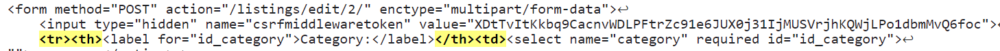

Again, I feel that these errors are out of my control and must unfortunately be accepted.

### basket.html

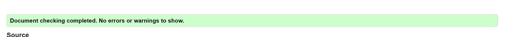

### checkout_success.html

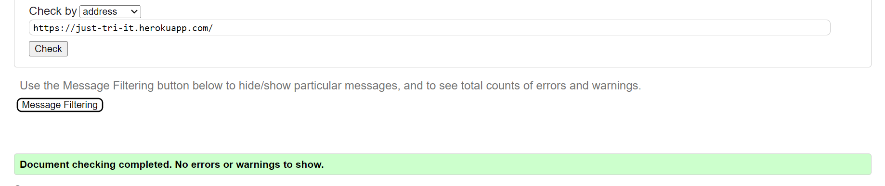

### checkout.html


### index.html


### add_category.html

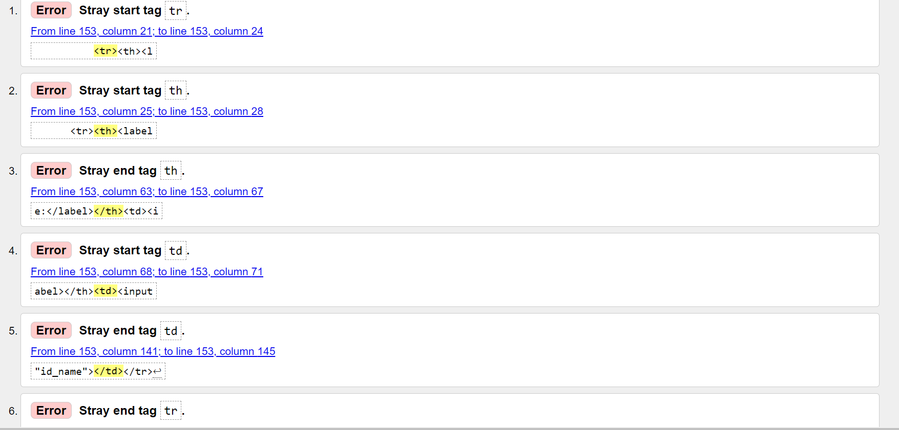

### add_condition.html

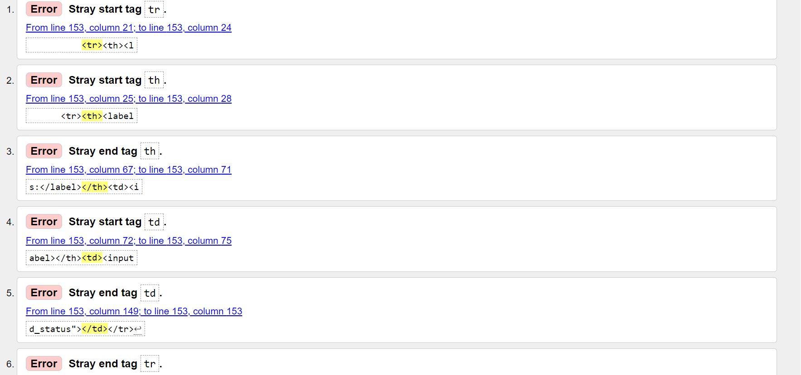

### add_listing.html

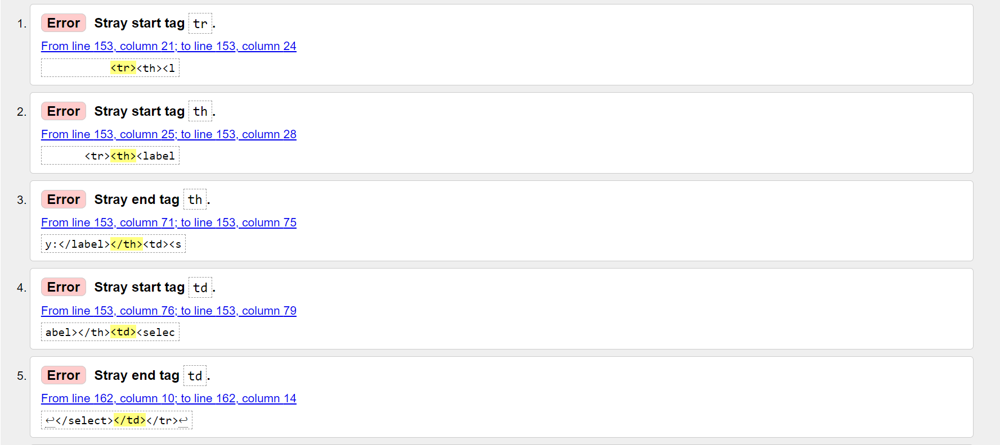

### categories_conditions.html

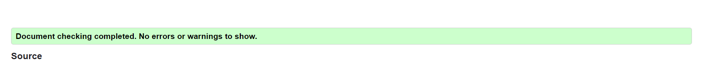

### edit_category.html

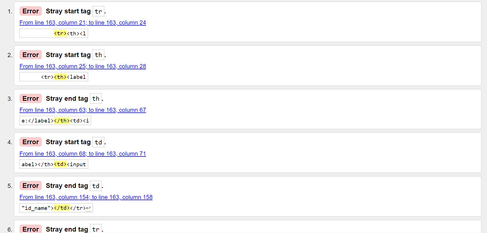

### edit_condition.html

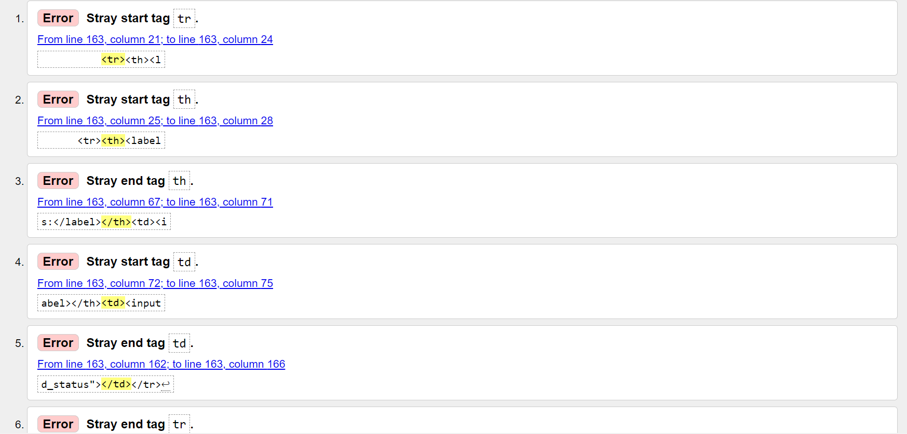

### edit_listing.html

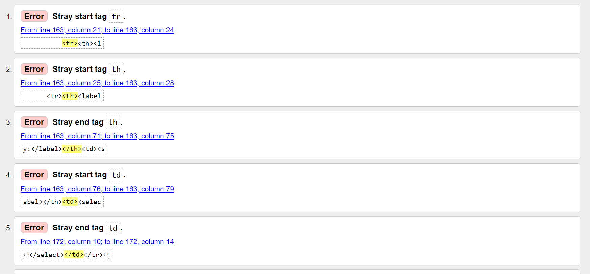

### listing_info.html

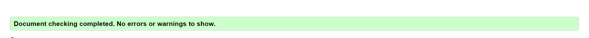

### lisitngs.html

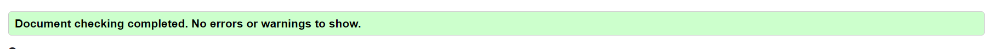

### edit_seller_status.html

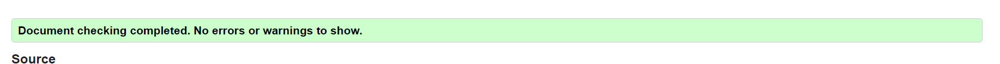

### profile_admin.html

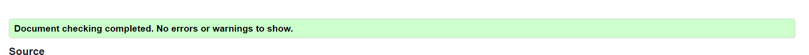

### profile.html

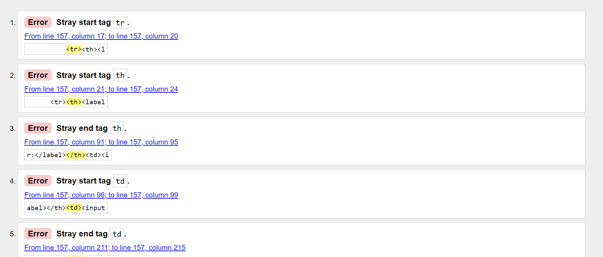

### base.html

As there are no errors arising from my own code across all pages where base.html is extended, it is assumed that there are no errors in base.html.

## CSS

Although the [CSS Validation](https://jigsaw.w3.org/css-validator/validator?uri=https%3A%2F%2Fjust-tri-it.herokuapp.com%2F&profile=css3svg&usermedium=all&warning=1&vextwarning=&lang=en#errors) one error and numerous warnings. All of these are from Materialize CSS. Unfortunately, these errors have to be accepted as they are inherited from the vendor extension selected for this project. I have found Materialize difficult to work with during this project and will utilise Bootstrap in future.

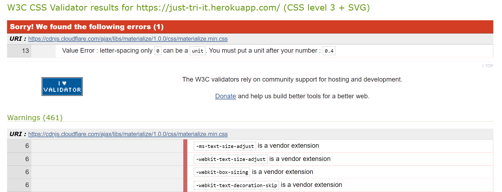

## JavaScript

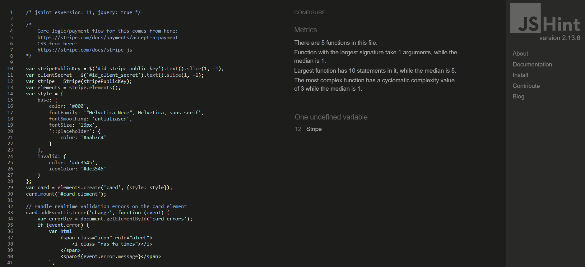

## Python

- As the website pep8online.com was not available to be used for validation. I utilised the python pycodestyle validation features built into the gitpod terminal.
- If the PROBLEMS tab showed that _no problems have been detected in the workspace_, I took this to mean that my python code was valid.
- I opened up all python files within a specific app and ensured that the terminal did not return any PROBLEMS.
- The results are documented in the screenshots below.
- Note: For certain lines of code greater than 79 characters, I had to use the # noqa decorator as breaking the code over two lines returned a syntax error.

### Basket App

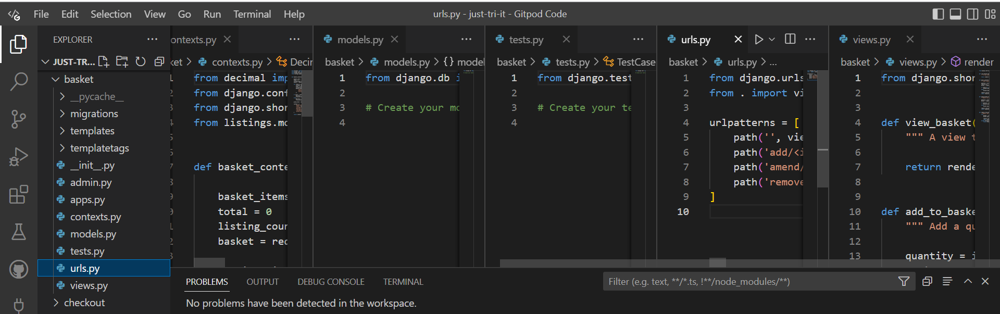

### Checkout App

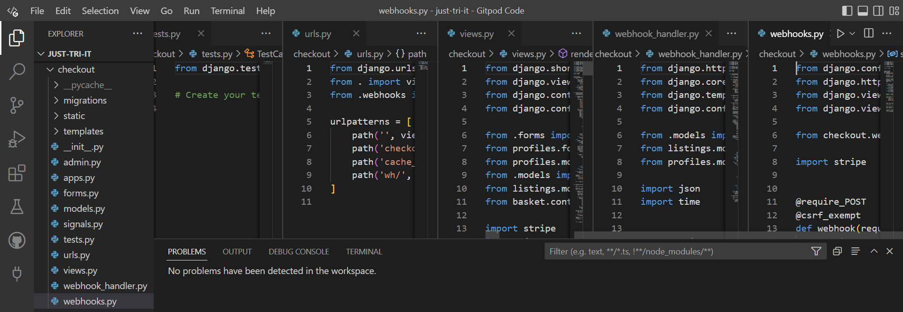

### Home App

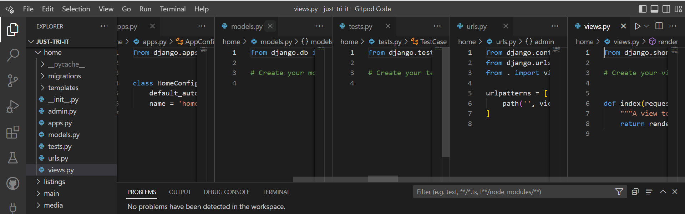

### Listings App

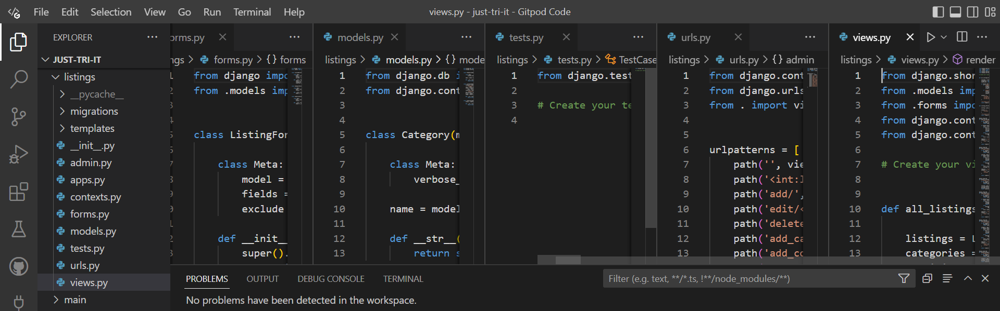

### Main App

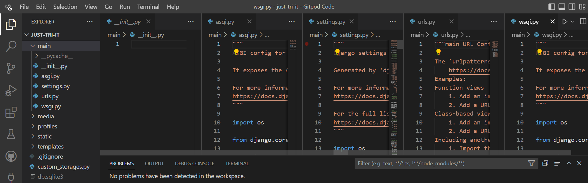

### Profiles App

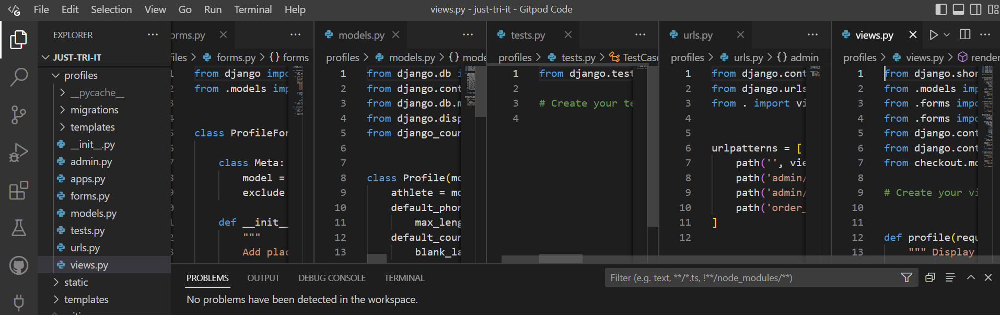

### custom_storages.py, env.py and manage.py

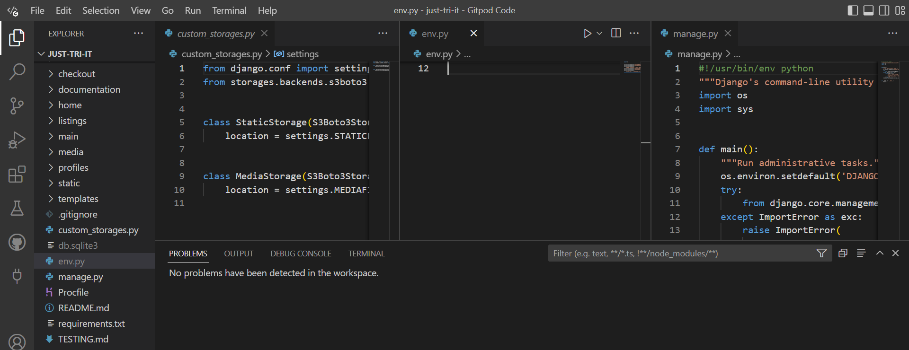

# Lightouse

Due to the numerous number of pages available to test, spot checks were conducted on the Home page and the All Listings page. The results are summarised in the screenshot below.

### Home Page Lighthouse

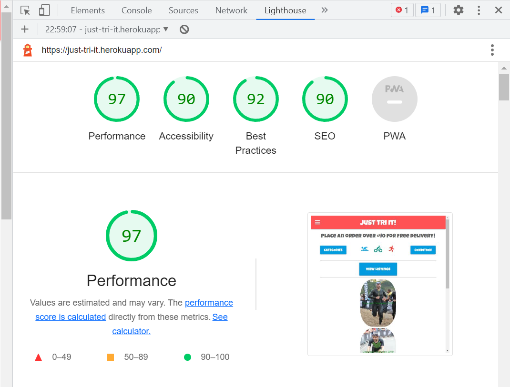

### Listings Page Lighthouse
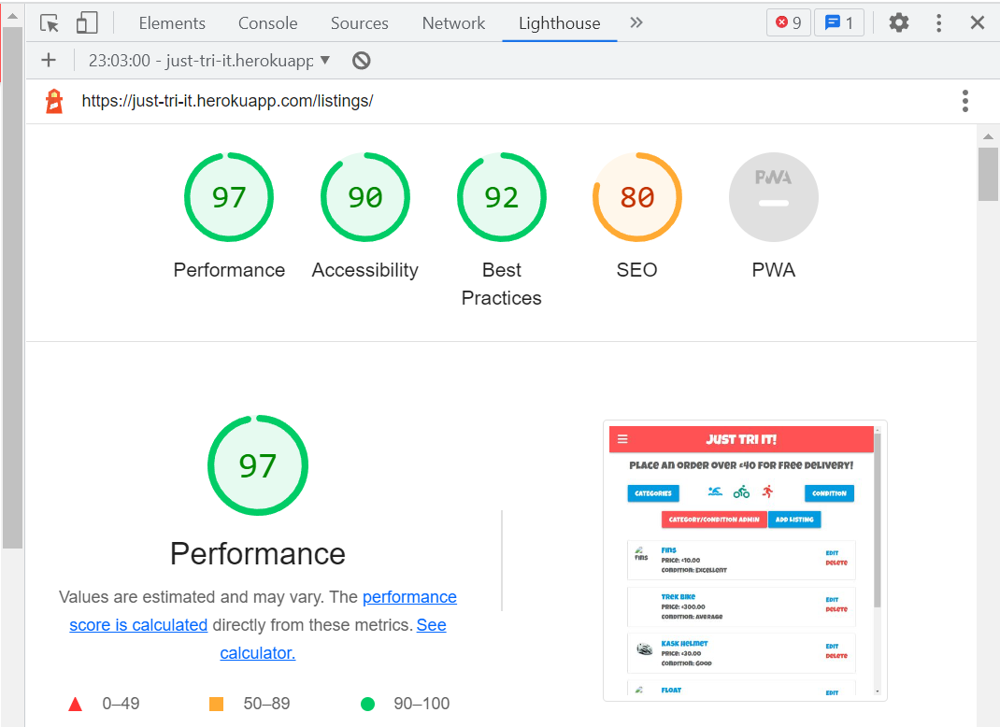

# Responsiveness

Due to the numerous number of pages available to test, spot checks were conducted on XXX. The results are summarised in the screenshot below.


# Error Handling

# Unfixed Bugs