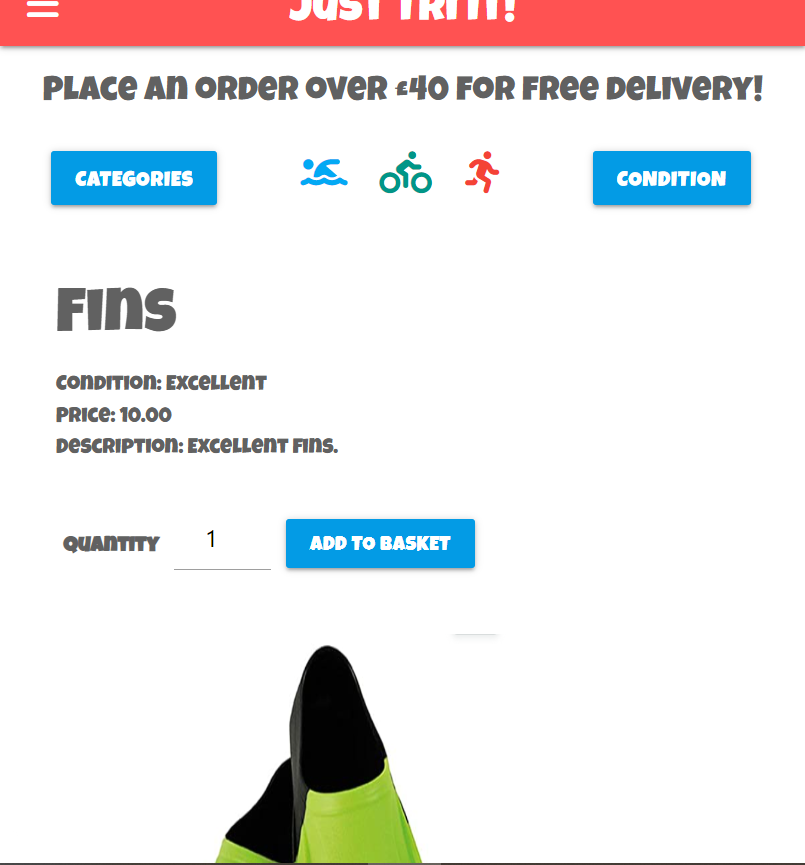
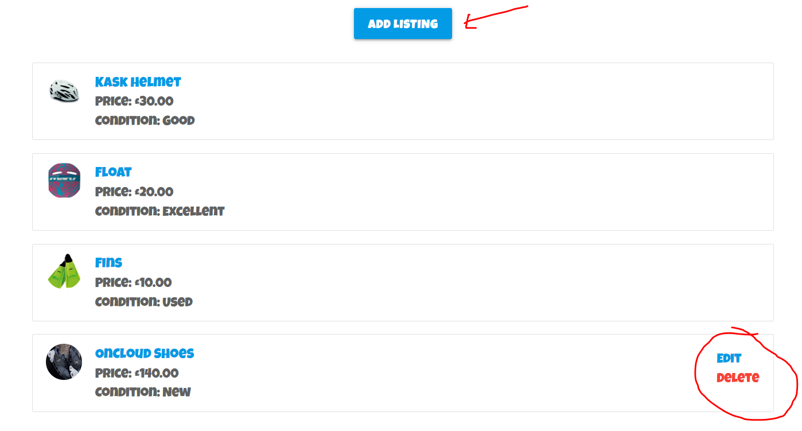
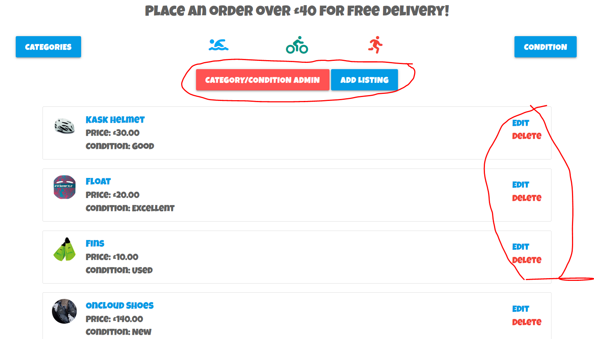
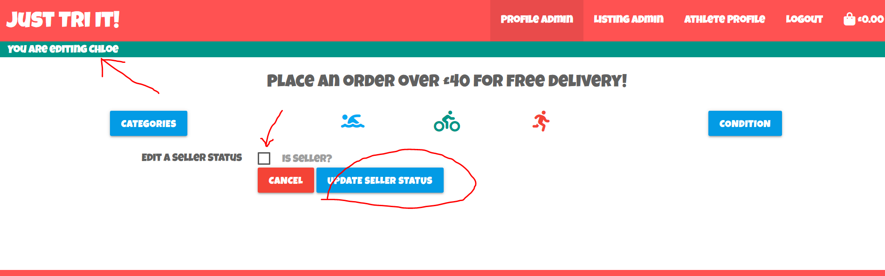
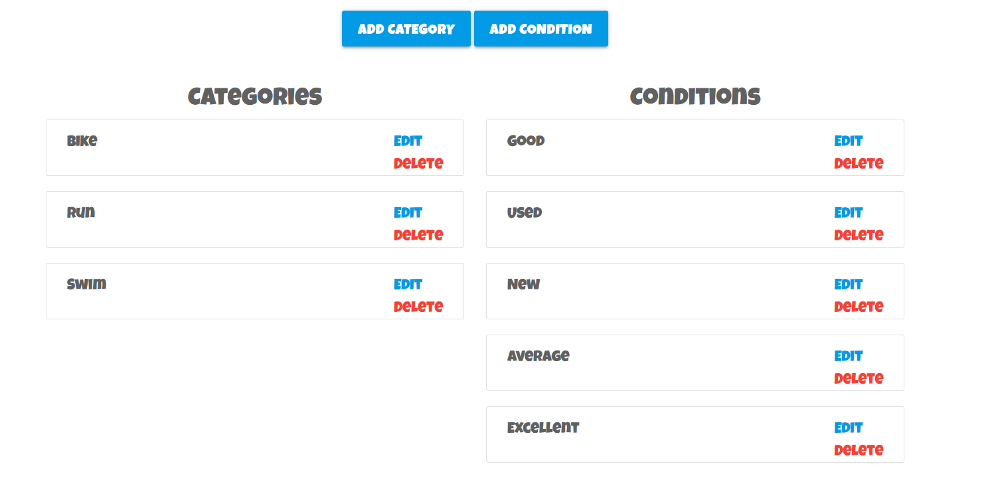

# Testing

# Browser Compatibility

Due to the numerous number of pages available to test, a different page will be showcased for the different browsers below to demonstrate browser compatibility.

## Chrome


## Edge


## Safari (Mobile)


# Code Validation

## HTML

Prior to displaying the results of the screeshots, I would like to make a note of the errors displayed for the following pages:
- add_category
- add_condition
- add_listing
- edit_category
- edit_condition
- edit_listing
- profile

The errors are caused by stray start tags ```<th>```, ```<tr>``` and ```<td>``` as well as stray end tags ```</th>```, ```</tr>``` and ```</td>```. All of the above pages utilise ```{{ form }}``` within the code where this issue arises from as shown in the screenshot below.


I was unsure of how to resolve these errors as they were seemingly inherited into my code. As I did not write the code causing these errors, I have included this section to demonstrate that I understand where the errors came from.

Finally, I have not included the html pages inherited from allauth in this section. A spot check of the sign up and sign out page yielded no errors.

### basket.html


### checkout_success.html


### checkout.html


### index.html


### add_category.html


### add_condition.html


### add_listing.html


### categories_conditions.html


### edit_category.html


### edit_condition.html


### edit_listing.html


### listing_info.html


### lisitngs.html


### edit_seller_status.html


### profile_admin.html


### profile.html


### base.html

As there are no errors arising from my own code across all pages where base.html is extended, it is assumed that there are no errors in base.html.

## CSS

Although the [CSS Validation](https://jigsaw.w3.org/css-validator/validator?uri=https%3A%2F%2Fjust-tri-it.herokuapp.com%2F&profile=css3svg&usermedium=all&warning=1&vextwarning=&lang=en#errors) one error and numerous warnings. All of these are from Materialize CSS. Unfortunately, these errors have to be accepted as they are inherited from the vendor extension selected for this project. I have found Materialize difficult to work with during this project and will utilise Bootstrap in future.


## JavaScript


## Python

- As the website pep8online.com was not available to be used for validation. I utilised the python pycodestyle validation features built into the gitpod terminal.
- If the PROBLEMS tab showed that _no problems have been detected in the workspace_, I took this to mean that my python code was valid.
- I opened up all python files within a specific app and ensured that the terminal did not return any PROBLEMS.
- The results are documented in the screenshots below.
- Note: For certain lines of code greater than 79 characters, I had to use the # noqa decorator as breaking the code over two lines returned a syntax error.

### Basket App


### Checkout App


### Home App


### Listings App


### Main App


### Profiles App


### custom_storages.py, env.py and manage.py


# Lightouse

Due to the numerous number of pages available to test, spot checks were conducted on the Home page and the All Listings page. The results are summarised in the screenshot below.

### Home Page Lighthouse


### Listings Page Lighthouse


# Responsiveness

Due to the numerous number of pages available to test, spot checks were conducted on the Home page, the Listings Page and the Listings Info page. The results are summarised in the screenshots below.

## Home Responsive


## Listings Responsive


## Listing Info Responsive




# User Story Tests

- As a user, I want to be able to add various listings to my basket before completing a purchase via a check out.

- As a user, I want to be able to filter listings by the three main triathlon disciplines of Swim, Bike and Run.

- As a user, I want to be able to filter listings by their condition such as New, Excellent, Good or Used.

- As a user, I want to be able to see an overall summary of all listings available to purchase.

- As a user, I want to be able to click on an individual listing to see more information regarding the listing.

- As a user, I want to be able to vary the quantity of a listing I can input into the basket when viewing the listing.

- As a user, I want to be able to update the quantity and/or remove a listing from my basket.

- As a user, I want to be able to create an account/profile.

- As a user, I want to be able to save default information in my account profile.

- As a user, I want to be able to view my previous order history.

- As a user with seller status, in addition to the above, I want to be able to add, edit and delete any listings I have uploaded.

- As a super user, in addition to the above, I want to be able to edit and delete any listing on the site.

- As a super user, in addition to the above, I want to be able to update a registered profile’s seller status.

- As a super user, in addition to the above, I want to be able to add, edit and delete categories and conditions.



# Error Handling

I am relying on Django's built in error handling as I had to prioritise other aspects of the site's functionality.

# Unfixed Bugs

-	Country dropdown on forms is a different colour to other fields, needs a CSS and JS fix.
-	Allauth pages are not formatted in the same style as the rest of the site.
-	If a product is deleted, the Order History on the Athlete Profile page just shows a blank space where the listing name shoud be along with a cost of £0.
-	I made an error at some point in the coding process and the loading-spinner icon no longer overlayed on the page whilst awaiting for checkout success. It was always displaying on the checkout page. It requires a CSS and JS fix but I had to prioritise other functionality over solving this bug.
- The 'Clear' button shows next to a listing's image but it has no functionality. Again, this needs a CSS/JS fix but I had to prioritise other functionality over this.
